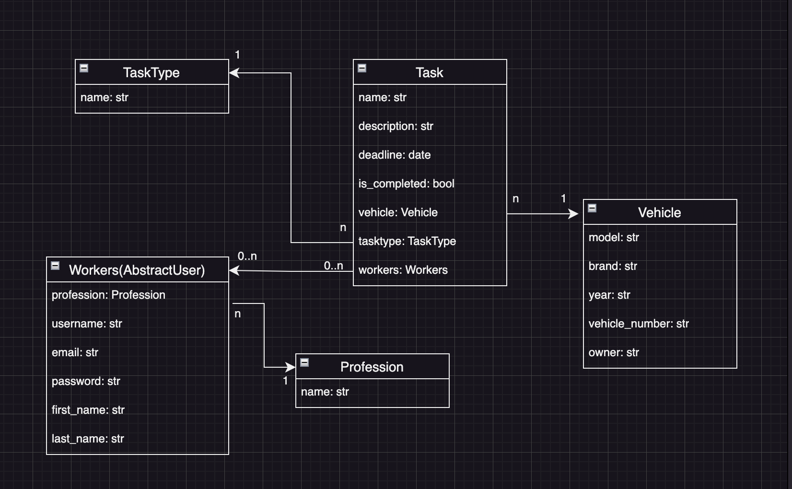

# Car service station

This site helps to manage the work of a car service center. With the help of this site, employees can create tasks and add cars. The site allows you to monitor the progress and deadline of tasks. 

The site has the following database structure:



## Check it out!

[Car-Service-Station](https://car-service-station.onrender.com/)

## Installation

Python 3 must be already installed!

```shell
git clone https://github.com/dirolius/car-service-station
cd car-service-station
python3 -m venv venv
source venv/bin/activate
pip install -r requirements.txt
touch .env
python manage.py migrate
python manage.py runserver
```
For Windows, the command "touch .env" will be "echo > .env"
#### For an example of filling out .env, see .env.sample!

## Features

 - Authorization for the worker
 - Detailed information about tasks, vehicles, and workers
 - Ability to track and change task progress and deadlines
 - Easy switching between vehicles and tasks for them

## Demo

You can use the following user to view the site

 - Login: Demo.user
 - Password: 5tgbvfr4
